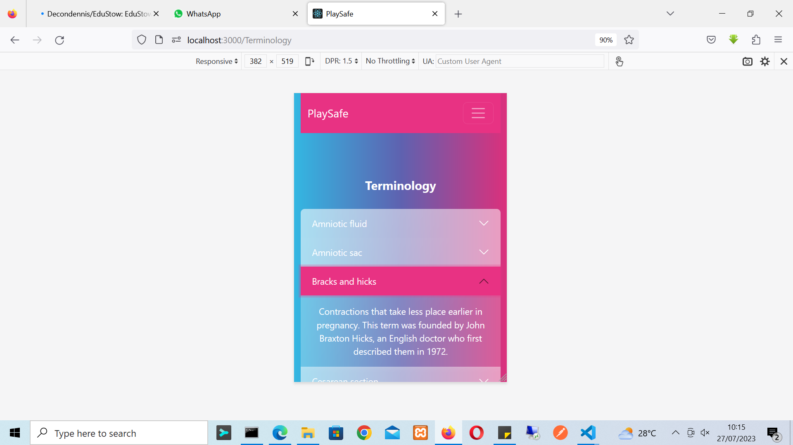

### Introducing PlaySafe: Empowering Couples on Their Family Planning Journey

PlaySafe is a revolutionary app designed to empower couples on their family planning journey. Family planning is a crucial aspect of modern relationships, allowing partners to make informed decisions about controlling the number of children in their family and the timing of their birth. With PlaySafe, we aim to provide a comprehensive and user-friendly platform that offers a range of essential features to support couples in this important endeavor.

## Key Features:

    Accurate and Effortless Fertility Tracking: PlaySafe simplifies the process of identifying safe days and fertile days for couples. By leveraging advanced algorithms, the app provides precise information about the most favorable periods for conception, allowing partners to plan their intimacy with confidence.

    Gender Selection Guidance: Dreaming of a baby boy or girl? PlaySafe offers an exciting feature to determine the gender of your baby. The app calculates the dates with higher likelihoods of conceiving a baby boy or girl, providing couples with a unique insight into their family planning journey.

    Pregnancy Progress and Insights: Once you conceive, PlaySafe becomes your companion throughout the pregnancy. Stay informed about your baby's weekly progress, receive valuable tips on what to expect during each stage, and learn about essential dos and don'ts to ensure a healthy pregnancy.

    Husbands' Support and Involvement: PlaySafe recognizes the importance of husbands' involvement during pregnancy. The app provides husbands with valuable information and resources, allowing them to better understand and support their wives throughout this beautiful journey. Access helpful tips on conception, breastfeeding, and immunization with just a click.

## Why Choose PlaySafe:

    Comprehensive and User-Friendly: PlaySafe is designed to be intuitive and easy to navigate, making it accessible to users of all levels of tech-savviness. The app presents complex fertility insights in a clear and straightforward manner, allowing couples to make informed decisions effortlessly.

    Privacy and Security: We prioritize your privacy and data security. PlaySafe adheres to strict privacy standards to ensure that your personal information remains confidential and protected at all times.

    Reliable and Scientifically Backed: Our app is built on the latest scientific research and medical knowledge related to fertility tracking and family planning. You can trust PlaySafe to provide accurate information and reliable guidance.

Together, let's embrace the power of knowledge and make informed choices for a brighter family planning future.

 PlaySafe, the cutting-edge family planning app developed using a robust tech stack that ensures a seamless user experience. Leveraging modern technologies and industry best practices, PlaySafe provides a secure and efficient platform for couples to plan their family with confidence. Let's explore the technologies and key components used in the development of PlaySafe:

### Tech Stack:

     React:
    PlaySafe's frontend is built using React, a popular JavaScript library for building user interfaces. React's component-based architecture allows for a modular and reusable codebase, ensuring a smooth and responsive user experience.

   ## React Bootstrap: 
   The app's UI components are designed using React Bootstrap, providing a consistent and mobile-friendly user interface across different devices.

   ## React DatePicker:
   PlaySafe uses React DatePicker to enable users to easily select dates for their family planning needs. The user-friendly date picker ensures a hassle-free experience.

   ## Modal Component:
    The app utilizes the Modal component from React Bootstrap to present important information and results to users in a clean and organized manner.

   ## Axios: 
    PlaySafe communicates with the backend server using Axios, a popular JavaScript library for making HTTP requests. This allows for efficient data exchange between the frontend and backend.

   ## JSON Web Tokens (JWT):
   For authentication and secure access, PlaySafe employs JSON Web Tokens. JWT ensures that user data and interactions remain private and protected.

   ## Node.js:
   The backend of PlaySafe is built using Node.js, a server-side JavaScript runtime. Node.js enables scalable and efficient handling of backend operations.

     Express: 
    PlaySafe uses Express, a Node.js web application framework, to create robust APIs and middleware for managing data flow and handling HTTP requests.

   ## Middleware: 
   PlaySafe employs middleware to enhance the app's functionality and improve data management. Middleware acts as a bridge between different components, optimizing the overall performance.

   ## Progressive Web Application (PWA):
   By embracing PWA technology, PlaySafe allows users to access the app from their browsers on various devices without the need for installations. This ensures a seamless and engaging experience for users.

Please note that while PlaySafe provides valuable insights, it is not a substitute for professional medical advice. Always consult with your healthcare provider for personalized guidance.

Empower your family planning journey with PlaySafe - your partner in building a happy and healthy future.
